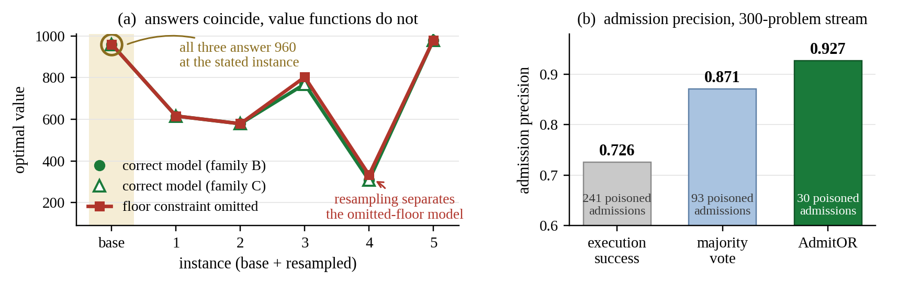
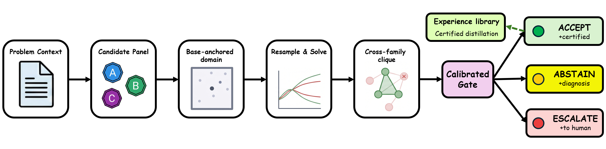
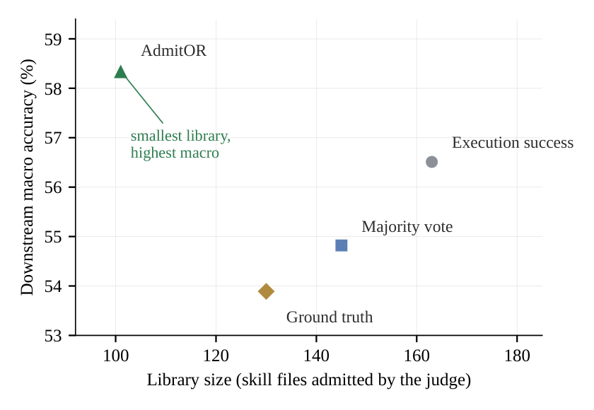
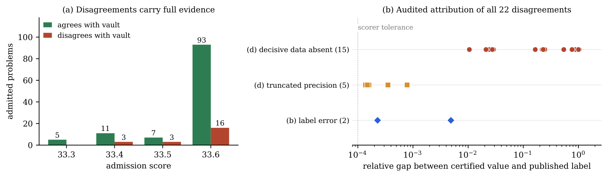

<div align="center">

# AdmitOR

### Admission Without Answers<br>Label-Free Certification and Experience Learning for LLM-Based Optimization Modeling

**Junbo Jacob Lian** &nbsp;·&nbsp; **Huiling Chen** &nbsp;·&nbsp; **Hanzhang Qin** &nbsp;·&nbsp; **Chung-Piaw Teo**

[](https://www.python.org/downloads/)
[](https://opensource.org/licenses/MIT)

[](https://github.com/junbolian/AdmitOR/releases/tag/v1.0.0)
[](#installation)
[](artifacts/MANIFEST.md)
[](https://github.com/fujiwaranoM0kou/OptSkills)

**Certify an optimization model's answer without ever seeing an answer key.**

</div>

---

## Contents

[What this is](#what-this-is) · [Key results](#key-results) · [Repository structure](#repository-structure) · [Installation](#installation) · [Quickstart](#quickstart) · [Reproducing the paper](#reproducing-the-paper) · [Artifacts](#artifacts) · [Limitations](#known-limitations) · [Citation](#citation)

---

## What this is

AdmitOR is an admission gate that decides whether a model-produced answer to an
optimization problem may be trusted, **without ever consulting an answer key**.

One extractor turns the problem text into a base-anchored parameter-domain
specification. Three model families then independently write solver code
against that shared specification, and each candidate is re-examined not on the
original instance alone but over a set of **resampled instantiations** of the
parameter domain, so what is compared is an entire induced value function
rather than a single number. Agreement is compressed into a maximum clique over
candidates that agree across every informative instantiation, and a verdict is
issued only when that clique **spans at least two model families**:

| Verdict | Meaning |
|---|---|
| `ACCEPT` | a cross-family clique agrees everywhere; its value at the unperturbed base instance is the certified answer |
| `ABSTAIN` | informative instances exist, but no cross-family clique does |
| `UNINFORMATIVE` | too few instantiations were solvable to judge anything at all |

A conformal calibration step then thresholds admission on clique geometry to a
target false-discovery budget, so the gate can be tuned to a **stated purity**
rather than a hope.



Two answers can coincide on the stated instance and still come from different
models. Resampling separates them, and the resulting purity ladder is what the
downstream library inherits.



---

## Key results

Downstream accuracy (%, round-aware scorer) of the host equipped with each
judge's library, on five public benchmarks. Every arm replays the same
collection logs, so **the judge is the only difference between rows**. Bold
marks the column best. This is Table 2 of the paper.

| Admission policy | ComplexOR | IndustryOR | Mamo.Complex | OptMATH-Bench | OptiBench | **Macro** |
|:---|---:|---:|---:|---:|---:|---:|
| GT labels | **66.67** | 31.00 | 52.61 | **56.02** | 63.14 | 53.89 |
| Vote | 61.11 | 33.00 | 53.55 | 54.22 | 72.23 | 54.82 |
| RunsOK | **66.67** | 35.00 | 53.08 | 55.42 | **72.40** | 56.51 |
| **Gate (AdmitOR)** | **66.67** | **39.00** | **57.82** | **56.02** | 72.23 | **58.35** |

> [!NOTE]
> The GT/OptiBench cell is dominated by 87 unparseable rows caused by
> skill-selector failures. Scored on parseable outputs only it rises to **73.5**
> (macro **55.95**), and the gate leads under either reading. See the paper for
> the dual-reported analysis.

<table>
<tr><td width="90"><b>K1</b></td><td>
All three label-free admission policies exceed the preregistered bar of
<b>70%</b> of the GT-supervised macro, landing at <b>102 to 108%</b> of it.
</td></tr>
<tr><td><b>K2</b></td><td>
Under a plate-stratified paired bootstrap, gate minus vote is <b>+3.53pp</b>
macro, 95% CI <b>[+0.87, +6.75]</b>, P(&Delta;&gt;0) = <b>0.9971</b>; gate minus GT is
<b>+4.46pp</b>, 95% CI <b>[+2.37, +6.64]</b>, P(&Delta;&gt;0) = <b>1.0000</b>.
Both intervals exclude zero.
</td></tr>
<tr><td><b>K4</b></td><td>
The family-by-outcome matrix over <b>298</b> stored certification runs is
significantly non-uniform (&chi;<sup>2</sup> = <b>30.96</b>, df <b>8</b>,
p = <b>1.4e-4</b>): crash behavior tracks the solver stack (<b>15 to 20%</b> for
the two Pyomo arms against <b>8%</b> for the Gurobi arm), instance infeasibility
is flat across arms, and value-level disagreements migrate to the arm that
crashes least (<b>30</b> against <b>9</b>).
</td></tr>
</table>



The certified library is the **smallest of the four and scores highest**.
Looser judges admit more and build larger libraries.

> [!WARNING]
> **K3 is a negative result, and we report it in full.** The calibrated
> false-discovery budget holds on calibration data but **fails transfer to the
> wild stream**: replay FDR is **15.9%** round-aware (**22 of 138** admissions;
> 95% upper bound **22.0%**) and **18.8%** under the 2-decimal ruler, against a
> preregistered bar of **5%**.
>
> A case-level audit attributes **2** disagreements to label errors (both
> certified values independently re-derived by exact re-solves, with the
> published labels below the true minima) and **20** to the problem text not
> being a faithful encoding of the labeled instance. The **15** cases whose
> decisive data never appear in the text lower-bound the measurable FDR of any
> text-faithful system on this stream at **10.9%**.



---

## Repository structure

```
AdmitOR/
├── admitor/                   THE GATE ITSELF
│   ├── consensus.py           L3 resampled cross-family value-function consensus
│   ├── ir_extract.py          extraction prompt, spec schema, validate_spec guardrails
│   ├── generate.py            candidate prompts and the subprocess solver sandbox
│   └── pipeline_one.py        single-problem entry point (live_run / mock_run)
│
├── scripts/                   EXPERIMENT DRIVERS
│   ├── data_audit.py          E0  dataset census and mining-pool overlap gate
│   ├── e0_scorecard.py        E0  paper vs reproduction, 3pp tolerance
│   ├── label_oracle.py        E1  the four judges (gt / vote / runsok / gate)
│   ├── e1_relabel.py          E1  replay one arm's judgement over shared logs
│   ├── e1_certify.py          E1  batch certification (the token-expensive step)
│   ├── e1_rebuild.py          E1  rebuild one skill library per arm
│   ├── e3_calibrate.py        E3  workorder / fit / replay conformal calibration
│   ├── k4_matrix.py           E3  family-by-outcome contingency table
│   ├── review_packet.py       E3  human-review packets for disputed admissions
│   ├── score_eval.py          the uniform round-aware scorer
│   ├── paired_bootstrap.py    plate-stratified paired bootstrap (K2)
│   ├── regen_derived.py       rebuild derived files and verify their sha256
│   └── runlog.py              the JSONL run-ledger substrate
│
├── datasets/                  PROBLEM SETS  (third-party, see datasets/README.md)
│   ├── benchmark/             the five evaluation benchmarks
│   ├── train_set/             OptMATH-Train, its blind variant, NANO-CO
│   └── vault/                 sealed answer book, opened only for grading
│
├── artifacts/                 RELEASED RESULTS  (see artifacts/MANIFEST.md)
│   ├── e1/certify_verdicts/   300 compact gate verdicts
│   ├── e1/certify_runs/       298 full verdicts with clique geometry
│   ├── e1/libraries/          the four skill libraries as evaluated
│   ├── e3/                    calibration, replay reports, K4 matrix
│   └── runlogs/               ledger excerpt (full ledger is a Release asset)
│
├── patches/                   OptSkills host patches as unified diffs
├── release_tools/             scrub_logs.py, make_manifest.py
├── tests/                     offline test suite, no API key needed
├── figures/                   paper figures (PNG for viewing, PDF source)
├── environment.yml            pinned conda environment
└── LICENSE                    MIT
```

---

## Installation

```bash
conda env create -f environment.yml
conda activate admitor
```

The pinned versions are the ones the paper's experiments actually ran on, read
off the environment snapshot frozen before the E1 certification campaign
(**Python 3.12.12**, Pyomo 6.10.0, HiGHS 1.15.1, NumPy 2.4.4, SciPy 1.18.0).
The code itself runs on **Python 3.8+**.

| Solver | Status | Notes |
|:---|:---|:---|
| **HiGHS** (`highspy`) | default, installed | open source, no licence, runs every test and every replay script |
| **Gurobi** (`gurobipy`) | optional, commercial | needed only to reproduce the `C-direct` candidate arm live |

Gurobi is not required by anything else. The core gate imports and passes its
full offline suite without it. To enable that arm:

```bash
pip install gurobipy==13.0.1   # academic licences: https://www.gurobi.com/academics
```

Confirm the install:

```bash
pytest -q
```

This runs **fully offline with no API key** and should report `14 passed`.

---

## Quickstart

**Step 1.** Run the offline self-test. It exercises the whole pipeline,
extraction through consensus, with no network and no credentials:

```bash
python -m admitor.pipeline_one --mock
```

**Step 2.** To certify a real problem, put the statement in a UTF-8 text file
and set the endpoint in your environment.

> [!IMPORTANT]
> Credentials are read from **environment variables only**. AdmitOR never reads
> a key from a file, and no endpoint is baked into the code.

<table>
<tr><th align="left">Linux / macOS</th><th align="left">Windows PowerShell</th></tr>
<tr valign="top">
<td>

```bash
export ADMITOR_API_KEY="your-key"
export ADMITOR_BASE_URL="https://api.openai.com/v1"
python -m admitor.pipeline_one \
    --question my_problem.txt --m 5
```

</td>
<td>

```powershell
$env:ADMITOR_API_KEY = "your-key"
$env:ADMITOR_BASE_URL = "https://api.openai.com/v1"
python -m admitor.pipeline_one `
    --question my_problem.txt --m 5
```

</td>
</tr>
</table>

`ADMITOR_BASE_URL` is the chat-completions base URL of any OpenAI-compatible
endpoint. The paper's three families are the defaults:

| Env var | Default | Strategy | Solver stack |
|:---|:---|:---|:---|
| `ADMITOR_MODEL_A` | `deepseek-v3.2` | direct | Pyomo + HiGHS |
| `ADMITOR_MODEL_B` | `gpt-5.4` | structured | Pyomo + HiGHS |
| `ADMITOR_MODEL_C` | `claude-sonnet-4-6` | direct | gurobipy |

All three run at **temperature 0**, with **m = 5** resampled instances plus the
mandatory base instance.

**Step 3.** Read the verdict. Artifacts land in `runs/<timestamp>/`: the
extracted specification, each family's generated solver script and raw
response, and the verdict itself.

```json
{
  "decision": "ACCEPT",
  "clique": ["B-structured", "C-direct"],
  "families": ["claude", "gpt"],
  "informative": [0, 1, 2, 3, 4, 5],
  "objectives": {
    "A-direct":     [960.0, 363.54, 706.35, 627.31, 237.84, 320.16],
    "B-structured": [960.0, 329.04, 706.35, 606.43, 204.39, 285.99],
    "C-direct":     [960.0, 329.04, 706.35, 606.43, 204.39, 285.99]
  },
  "statuses": { "A-direct": ["optimal", "optimal", "..."] },
  "diagnoses": {
    "A-direct": "diverges from consensus by 34.5 on instance 1 (params: ...)"
  }
}
```

- **Index 0** is the unperturbed base instance, so `objectives[clique[0]][0]` is
  the certified answer to the original problem.
- **Indices 1 and up** are the resampled instantiations.
- `diagnoses` explains, for every candidate outside the clique, what excluded it.

> [!CAUTION]
> A non-ACCEPT verdict **certifies nothing**. The correct downstream behavior is
> to abstain or escalate, never to fall back on an uncertified value.

---

## Reproducing the paper

Three experiments, in order: **E0** calibrates the bench, **E1** is the main
result, **E3** is the conformal calibration and its negative transfer finding.

The datasets ship in `datasets/`, so nothing needs downloading. All three do
need the OptSkills host, which is not redistributed here.

<details>
<summary><b>Host setup</b> (click to expand)</summary>

```bash
git clone https://github.com/fujiwaranoM0kou/OptSkills.git
cd OptSkills
git checkout 7d3194098e17f8f032359d8ad507bbe6bfc208fa
git apply /path/to/AdmitOR/patches/llm_caller.patch
git apply /path/to/AdmitOR/patches/runner.patch
```

See [`patches/README.md`](patches/README.md) for what each patch does and for
the Windows line-ending note. Configure the host's own credentials as its
README describes.

</details>

### What this costs

**Measured, not estimated**, from the shipped run ledger.

| Phase | Model calls | Tokens |
|:---|---:|---:|
| Host-side generation (E0, E1 collection, 4 library rebuilds, all eval sweeps) | **60,000** | **589,902,200** |
| ...plus served from cache | 33,196 | n/a |
| ...terminal failures | 713 | n/a |
| E1 certification (recovered from artifacts) | ≥ 1,190 | not ledgered |
| E3 calibration (recovered from artifacts) | ≥ 592 | not ledgered |

The ledger does not split the host total by phase, because every host call
carries the same run id. Certification calls do not appear in it at all: they
go through AdmitOR's own client rather than the host transport, so their volume
is recovered from the artifacts instead (298 + 148 extractions, 892 + 444
candidate generations, plus one repair round per candidate that failed its
base-instance probe).

Steps below are marked 🔴 **costs tokens** or 🟢 **free**. Every free step runs
off data already in this repository.

### E0: bench calibration

Reproduce the host's published accuracy on the five benchmarks, then check it
lands within 3 percentage points. This exists so that any later AdmitOR number
is measured on a bench known to match the host.

🟢 **Free.** Confirm the mining pool does not overlap any evaluation benchmark.
This is a hard gate:

```bash
python scripts/data_audit.py --root datasets
```

🔴 **Costs tokens.** Run the host's eval phase once per benchmark, from the
host root:

```bash
cd /path/to/OptSkills
python main.py --phase eval \
    --data /path/to/AdmitOR/datasets/benchmark/optibench.jsonl \
    --run-dir outputs/eval/optibench --resume --eval-workers 12 --timeout 120
```

Repeat with `mamo_complex_test.jsonl`, `optmath_bench.jsonl`,
`industryor.jsonl` and `complexor.jsonl`, changing `--run-dir` to match.

🟢 **Free.** Score each run, then read the verdict:

```bash
cd /path/to/AdmitOR
python scripts/score_eval.py /path/to/OptSkills/outputs/eval/optibench/trajectories.jsonl
python scripts/e0_scorecard.py scorecard.json
```

Running the scorecard with no existing file writes a blank template to fill in.

### E1: the judge swap

E1 collects rollouts once and replays them under four judges, so the judge is
the only moving part.

🟢 **Free.** Verify the blind mining file, which is what the gate mines. The
gate must never see the answers:

```bash
python scripts/regen_derived.py --source datasets/train_set/optmath-train-300.jsonl
```

Both outputs are checked against the sha256 fingerprints the paper used. The
shipped `datasets/train_set/optmath-train-300-blind.jsonl` is that same file.

🔴 **Costs tokens, the single most expensive step.** Collect rollouts once,
from the host root:

```bash
cd /path/to/OptSkills
python main.py --phase cluster \
    --data /path/to/AdmitOR/datasets/train_set/optmath-train-300-blind.jsonl \
    --run-dir outputs/e1/collect --resume \
    --cluster-eps 0.05 --cluster-min-samples 1 --agent-max-turns 12
```

🔴 **Costs tokens.** Certify every problem with AdmitOR. This produces the gate
arm's judgements:

```bash
cd /path/to/AdmitOR
export ADMITOR_API_KEY="your-key"
export ADMITOR_BASE_URL="https://your-endpoint/v1"

python scripts/e1_relabel.py \
    --collect /path/to/OptSkills/outputs/e1/collect/trajectories.jsonl \
    --arm gate --verdicts-dir outputs/e1/verdicts \
    --out outputs/e1/arms/gate.jsonl \
    --work-order outputs/e1/gate_workorder.jsonl

python scripts/e1_certify.py \
    --work-order outputs/e1/gate_workorder.jsonl \
    --verdicts-dir outputs/e1/verdicts \
    --runs-dir outputs/e1/certify_runs --m 5
```

The first call emits the work order of problems still needing certification;
`e1_certify.py` is resumable, so rerun the pair until the work order comes back
empty.

> [!TIP]
> To skip this step entirely, point `--verdicts-dir` at the **300 verdicts we
> already shipped** in `artifacts/e1/certify_verdicts/`.

🟢 **Free.** Relabel under the remaining three judges. These are pure offline
rewrites of logs that already exist:

```bash
python scripts/e1_relabel.py --collect <collect trajectories> --arm vote \
    --out outputs/e1/arms/vote.jsonl
python scripts/e1_relabel.py --collect <collect trajectories> --arm runsok \
    --out outputs/e1/arms/runsok.jsonl
python scripts/e1_relabel.py --collect <collect trajectories> --arm gt \
    --labels datasets/vault/optmath-train-300-labels.jsonl \
    --out outputs/e1/arms/gt.jsonl
```

🔴 **Costs tokens.** Rebuild one skill library per arm, from the host root.
Pass exactly the geometry the collect run used or the comparison is confounded:

```bash
cd /path/to/OptSkills
python /path/to/AdmitOR/scripts/e1_rebuild.py \
    --relabeled /path/to/AdmitOR/outputs/e1/arms/gate.jsonl \
    --library outputs/e1/libs/skill_library_gate \
    --cluster-eps 0.05 --cluster-min-samples 1 \
    --archetype-fusion-alpha 0.55 --agent-max-turns 12
```

Repeat for `vote`, `runsok` and `gt`. The four libraries we evaluated ship in
`artifacts/e1/libraries/` if you would rather not rebuild them.

🔴 **Costs tokens.** Evaluate each library on all five benchmarks:

```bash
python main.py --phase eval \
    --data /path/to/AdmitOR/datasets/benchmark/optibench.jsonl \
    --source-skill-library outputs/e1/libs/skill_library_gate \
    --run-dir outputs/e1/eval/gate/optibench --resume --eval-workers 12
```

🟢 **Free.** Score the matrix and the confidence intervals, reproducing **K1**
and **K2**:

```bash
cd /path/to/AdmitOR
python scripts/score_eval.py <eval trajectories>
python scripts/paired_bootstrap.py --eval-root <your e1 eval root> \
    --pairs gate:vote gate:gt --reps 10000 --seed 42
```

Eval trajectories embed the benchmark problem text and run to hundreds of
megabytes, so they are not shipped; this last step needs your own eval run.

### E3: conformal calibration and its transfer failure

🟢 **Free.** Build a calibration work order from NANO-CO. Its answers are
solver-verified by construction, so each ACCEPT self-labels as a true or false
clique with no benchmark labels touched:

```bash
python scripts/e3_calibrate.py workorder \
    --nano datasets/train_set/nano-co.jsonl \
    --out outputs/e3/e3_workorder.jsonl \
    --labels outputs/e3/e3_labels.jsonl --n 150 --seed 42
```

🔴 **Costs tokens.** Certify that work order with the unchanged certifier:

```bash
python scripts/e1_certify.py --work-order outputs/e3/e3_workorder.jsonl \
    --verdicts-dir outputs/e3/verdicts --runs-dir outputs/e3/certify_runs
```

🟢 **Free.** Fit the conformal threshold:

```bash
python scripts/e3_calibrate.py fit --runs outputs/e3/certify_runs \
    --labels outputs/e3/e3_labels.jsonl --alpha 0.05 \
    --out outputs/e3/calibration.json
```

🟢 **Free.** Replay the calibrated rule onto the 300 E1 verdicts. This is the
step that produces the **K3** negative result, and it runs entirely off shipped
artifacts:

```bash
python scripts/e3_calibrate.py replay \
    --calibration artifacts/e3/calibration.json \
    --e1-runs artifacts/e1/certify_runs \
    --verdicts artifacts/e1/certify_verdicts \
    --workorder outputs/e1/gate_workorder.jsonl \
    --vault datasets/vault/optmath-train-300-labels.jsonl \
    --out outputs/e3/e3_report.json
```

🟢 **Free.** The **K4** matrix:

```bash
python scripts/k4_matrix.py --e1-runs artifacts/e1/certify_runs \
    --out outputs/e3/k4_matrix.json
```

`k4_matrix.py` emits the contingency table. The chi-squared test of
independence reported in the paper is computed from that table, and this
one-liner reproduces the exact reported statistic from the shipped artifact:

```bash
python -c "import json;from scipy.stats import chi2;m=json.load(open('artifacts/e3/k4_matrix.json'))['matrix'];a=sorted(m);o=sorted({x for c in m.values() for x in c});O=[[m[i].get(j,0) for j in o] for i in a];R=[sum(r) for r in O];C=[sum(O[i][j] for i in range(len(a))) for j in range(len(o))];N=sum(R);s=sum((O[i][j]-R[i]*C[j]/N)**2/(R[i]*C[j]/N) for i in range(len(a)) for j in range(len(o)));d=(len(a)-1)*(len(o)-1);print(f'chi2={s:.2f} df={d} p={chi2.sf(s,d):.1e}')"
```

Expected output: `chi2=30.96 df=8 p=1.4e-04`

🟢 **Free.** Assemble the human-review packets behind the K3 case-level audit:

```bash
python scripts/review_packet.py --report artifacts/e3/e3_report_v06.json \
    --e1-runs artifacts/e1/certify_runs \
    --workorder outputs/e1/gate_workorder.jsonl --out outputs/e3/review
```

---

## Artifacts

`artifacts/` holds what the paper promises.

| Path | Contents |
|:---|:---|
| `artifacts/e1/certify_verdicts/` | **300** compact gate verdicts |
| `artifacts/e1/certify_runs/` | **298** full verdicts with clique geometry |
| `artifacts/e1/libraries/` | the **four** skill libraries exactly as evaluated |
| `artifacts/e3/` | calibration, both replay reports, the K4 matrix |
| `artifacts/runlogs/` | a **2,000**-record excerpt of the per-call ledger |

[`artifacts/MANIFEST.md`](artifacts/MANIFEST.md) is the index. It lists every
artifact, dataset and figure with its size, its sha256 and the paper table or
figure it backs, and it explains what is deliberately absent and why. Verify
the whole set at any time:

```bash
python release_tools/make_manifest.py
```

One artifact is too large to commit and is attached to the
[**v1.0.0 Release**](https://github.com/junbolian/AdmitOR/releases/tag/v1.0.0)
instead: `admitor-v1.0.0-runlogs.zip`, the complete scrubbed per-call run
ledger of **93,909** records. Its sha256 is recorded in the manifest, so
manifest and release cross-verify. The ledger stays a Release asset by design:
it grows with every campaign and must not accumulate in git history.

Every artifact was passed through `release_tools/scrub_logs.py` before release.
That script is **committed**, so the scrubbing is auditable rather than merely
asserted.

---

## Known limitations

<table>
<tr><td width="230"><b>Conditional on extraction</b></td><td>
All three candidate families consume one shared base specification, so
consensus cannot detect an extraction-layer error: if the extractor misreads
the problem, every family inherits the same misreading and agrees for the wrong
reason. Read every certificate as a statement about the <i>extracted instance</i>,
not about the original text.
</td></tr>
<tr><td><b>Agreement, not intent</b></td><td>
If every family misreads the text in the same way, no amount of resampling can
object. This is why the guarantee is a calibrated false-discovery budget on the
admitted stream rather than a correctness claim about any single admission.
</td></tr>
<tr><td><b>Purity costs coverage</b></td><td>
The gate abstains on a substantial fraction of the stream, which is the right
trade in library-poisoning settings and a real cost where every problem needs
an answer.
</td></tr>
<tr><td><b>Calibration transfer</b></td><td>
The conformal budget is only as good as the match between calibration and
deployment, and E3 measures exactly that failing. See <b>K3</b> above.
</td></tr>
<tr><td><b>Backbone transferability</b></td><td>
Untested. Our host uses a single generation backbone for candidate rollouts, so
the judge-swap evidence isolates the judge but not backbone diversity on the
host side. The gate's own panel is cross-family by construction, and porting
the protocol to a multi-backbone host is direct, but we have not measured it.
</td></tr>
</table>

See the paper's Limitations section for the full discussion.

---

## Citation

```bibtex
@article{lian2026admitor,
  title   = {Admission Without Answers: Label-Free Certification and
             Experience Learning for LLM-Based Optimization Modeling},
  author  = {Lian, Junbo Jacob and Chen, Huiling and Qin, Hanzhang and
             Teo, Chung-Piaw},
  journal = {arXiv preprint arXiv:XXXX.XXXXX},
  year    = {2026}
}
```

The arXiv identifier is a placeholder until the preprint is posted.

---

## License and acknowledgements

Released under the **MIT License**. See [`LICENSE`](LICENSE).

The datasets under `datasets/` are **third-party** and remain subject to their
own upstream terms. See [`datasets/README.md`](datasets/README.md) for the
per-benchmark attribution.

AdmitOR runs inside [**OptSkills**](https://github.com/fujiwaranoM0kou/OptSkills),
the skill-learning host system, and we thank its authors:

```bibtex
@article{yang2026optskills,
  title   = {{OptSkills}: Learning Generalizable Optimization Skills from
             Problem Archetypes via Cluster-Based Distillation},
  author  = {Yang, Haochen and Zhao, Ke and Qian, Hong},
  journal = {arXiv preprint arXiv:2605.29829},
  year    = {2026}
}
```

No OptSkills source is redistributed here. Our behavioral changes to it ship as
unified diffs in [`patches/`](patches/), to be applied to your own checkout at
the pinned upstream commit. OptSkills is itself MIT licensed, which would
permit redistributing modified copies; we ship patches anyway so that what is
ours and what is theirs stays unambiguous.

<div align="center">

---

[Repository](https://github.com/junbolian/AdmitOR) · [Release v1.0.0](https://github.com/junbolian/AdmitOR/releases/tag/v1.0.0) · [Artifact manifest](artifacts/MANIFEST.md) · [Host patches](patches/) · [Datasets](datasets/README.md)

</div>
